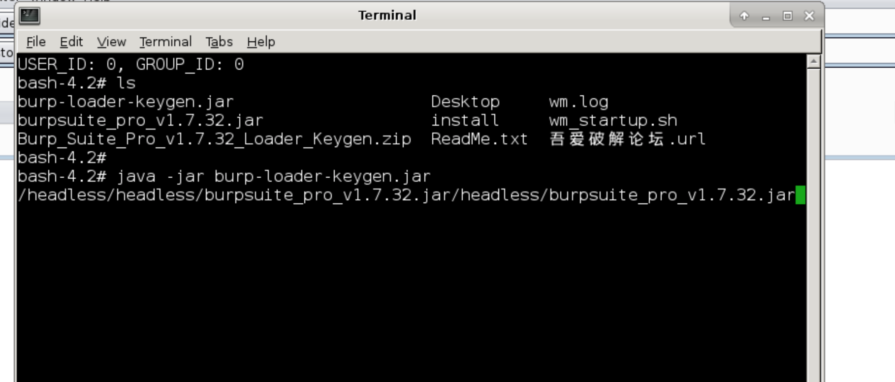
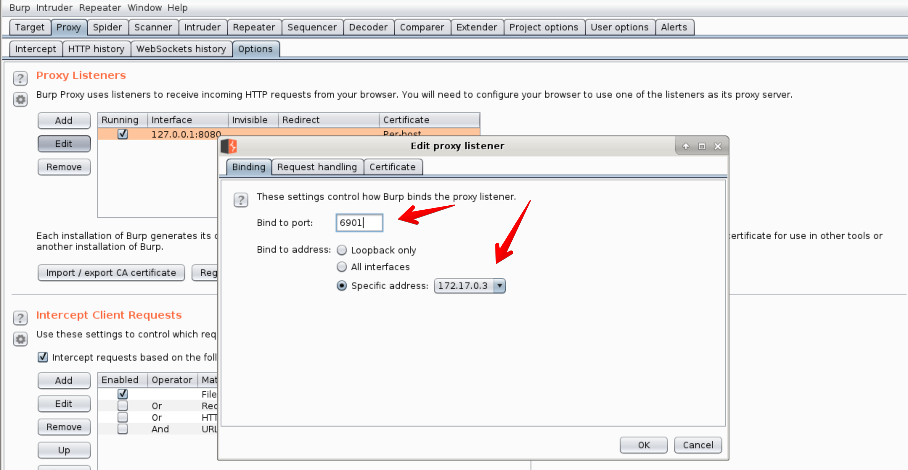
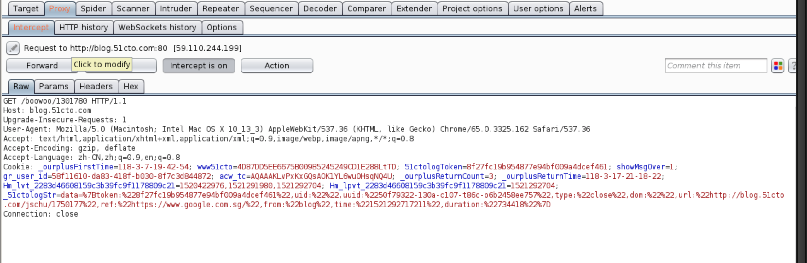

# docker4burp
**说明**

1、[thx and fork frome docker-headless-vnc-container](https://github.com/ConSol/docker-headless-vnc-container)

2、为了更简洁的使用burp删除了原镜像中的firefox、chrome、novnc

3、所以你可能需要vnc viewer客户端（realvnc）、或者vnc viewer浏览器插件来链接vnc

**启动你的burp**

```shell
docker run -d -p 5901:5901 -p 6901:6901 nancheal/docker4burp
```

**端口映射**

- 5091 -> vnc端口

- 6091 -> burp监听端口

**登入之后我需要做些什么？**

```shell
java -jar burp-loader-keygen.jar
```



**如何激活burp？**

[看这里](https://www.52pojie.cn/thread-691448-1-1.html)

**如何设置监听**



**最终效果**




## Todo

1、启动container自动运行burp

2、精简镜像大小

3、替换壁纸